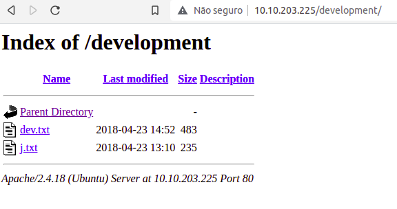
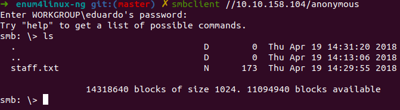

# Write-up Basicpentesting {THM} #
------------------------------
### **QUESTION 01**: Find the services exposed by the machine ###

<br>

**STEP01**: Scan the target to find the services. I will use Nmap, but you can use any other technique or tool you prefer. 
<br>
run: **nmap -A target**
 
 ```
 nmap -A 10.10.148.138
 ```
```
Nmap scan report for 10.10.148.138
Host is up (0.24s latency).
Not shown: 994 closed ports

PORT     STATE SERVICE     VERSION

22/tcp   open  ssh         OpenSSH 7.2p2 Ubuntu 4ubuntu2.4 (Ubuntu Linux; protocol 2.0)
| ssh-hostkey: 
|   2048 db:45:cb:be:4a:8b:71:f8:e9:31:42:ae:ff:f8:45:e4 (RSA)
|   256 09:b9:b9:1c:e0:bf:0e:1c:6f:7f:fe:8e:5f:20:1b:ce (ECDSA)
|_  256 a5:68:2b:22:5f:98:4a:62:21:3d:a2:e2:c5:a9:f7:c2 (ED25519)


80/tcp   open  http        Apache httpd 2.4.18 ((Ubuntu))
|_http-server-header: Apache/2.4.18 (Ubuntu)
|_http-title: Site doesn't have a title (text/html).


139/tcp  open  netbios-ssn Samba smbd 3.X - 4.X (workgroup: WORKGROUP)


445/tcp  open  netbios-ssn Samba smbd 4.3.11-Ubuntu (workgroup: WORKGROUP)


8009/tcp open  ajp13       Apache Jserv (Protocol v1.3)
| ajp-methods: 
|_  Supported methods: GET HEAD POST OPTIONS


8080/tcp open  http        Apache Tomcat 9.0.7
|_http-favicon: Apache Tomcat
|_http-open-proxy: Proxy might be redirecting requests
|_http-title: Apache Tomcat/9.0.7
Service Info: Host: BASIC2; OS: Linux; CPE: cpe:/o:linux:linux_kernel


Host script results:
|_clock-skew: mean: 1h19m59s, deviation: 2h18m34s, median: 0s
|_nbstat: NetBIOS name: BASIC2, NetBIOS user: <unknown>, NetBIOS MAC: <unknown> (unknown)
| smb-os-discovery: 
|   OS: Windows 6.1 (Samba 4.3.11-Ubuntu)
|   Computer name: basic2
|   NetBIOS computer name: BASIC2\x00
|   Domain name: \x00
|   FQDN: basic2
|_  System time: 2021-11-01T21:08:46-04:00
| smb-security-mode: 
|   account_used: guest
|   authentication_level: user
|   challenge_response: supported
|_  message_signing: disabled (dangerous, but default)
| smb2-security-mode: 
|   2.02: 
|_    Message signing enabled but not required
| smb2-time: 
|   date: 2021-11-02T01:08:46
|_  start_date: N/A

Service detection performed. Please report any incorrect results at https://nmap.org/submit/ .
Nmap done: 1 IP address (1 host up) scanned in 69.86 seconds
```
Here we can see some interesting things: 
* Nmap showed us that there is a Web application running on port 80, HTTP port.
* An OpenSSH running on port 22.
* Interestingly, the site has an SMB server running. We can explore it later perhaps.

---
### **QUESTION 02**: What is the name of the hidden directory on the web server(enter name without /)? ###
> The first thing that comes to mind is to check if the robots.txt file is indexed. Sometimes it can bring us valuable information.
> But, when i acess http://10.10.203.225/robots.txt the server response was **404 not found**
> Unfortunately for us, he is hidden.

**STEP01**: But, backing to the point. For found hidden directories i like to use **Dirb** or **Dirbuster**, but there is also **Gobuster**, which is used a lot. It's up to you, just as with Nmap. I will use Gobuster
<br>
run: **gobuster -w wordlist -u target**

```
gobuster -w /usr/share/dirb/wordlists/common.txt -u 10.10.203.225
```
The result:

```
=====================================================
Gobuster v2.0.1              OJ Reeves (@TheColonial)
=====================================================
[+] Mode         : dir
[+] Url/Domain   : http://10.10.203.225/
[+] Threads      : 10
[+] Wordlist     : /usr/share/dirb/wordlists/common.txt
[+] Status codes : 200,204,301,302,307,403
[+] Timeout      : 10s
=====================================================
2021/11/15 22:27:52 Starting gobuster
=====================================================
/.hta (Status: 403)
/.htaccess (Status: 403)
/.htpasswd (Status: 403)
/development (Status: 301)
/index.html (Status: 200)
/server-status (Status: 403)
=====================================================

```

> Oh my god, we found it! So the Answer for this question is 
## ANSWER: development ##
> Lets see what have in development:



---

### **QUESTION 03**: WHAT'S THE USERNAME ? ###

> We found some files. And we know the name of two people. J and K. 

>Looking carefully at the answer field I realized that it is only three letters. And that if we pronounce K and J it is also three letters. A matter of phonetics.

> So i attempt: jay, jey (nothing...)

>So i attempt: kay, key (nothing...)

>Enough of trying, now let's use our heads. I have two things in mind, enumerate the SMB server with the enum4linux tool or use smbclient.


**STEP 01:** Use enum4linux to find username. So lets run **python3 enum4linux-ng.py -A target** (of course you need install enum4linux if you not using Kali Linux)

in my case:
```
python3 enum4linux-ng.py -A 10.10.158.104
```


Looking the result, i not found the username. But the SBM server have anonymous login enabled. And now, we can use **smbclient** 

**STEP 02:** SMB Servers have an option to let anonymous users log in. We can try to log in.
We can just use this syntax:
```
smbclient //<target>/anonymous
```
in my case
```
smbclient //10.10.158.104/anonymous
```

*Press Enter*. And then run **ls** to list the directory. 
Look! We found a file!



run **more staff.txt** to see the content, and we discovered the username: Jan or Kay (I know its Jan because I have tried Kay before)

## ANSWER: Jan ##
